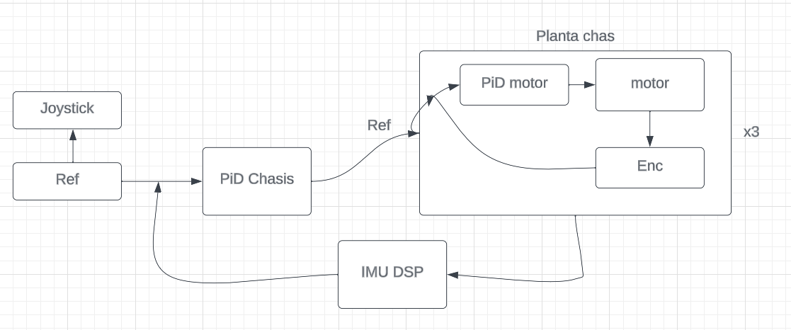
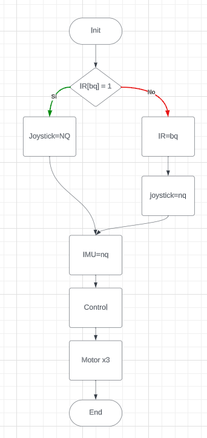
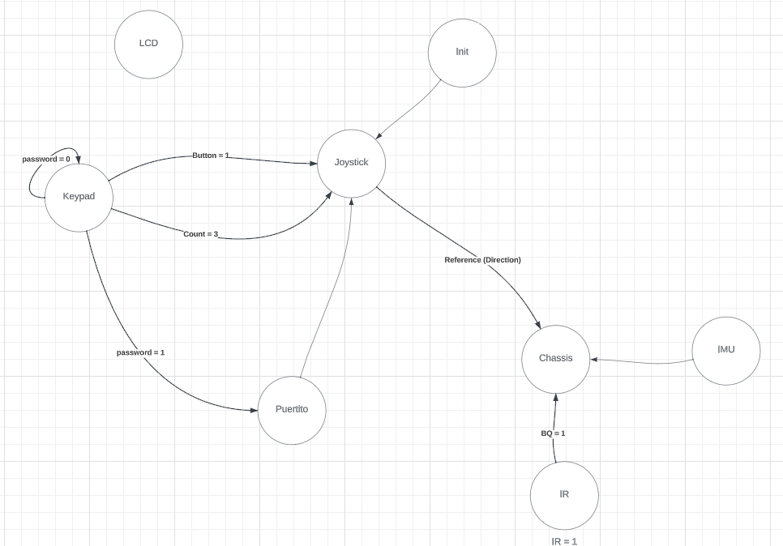
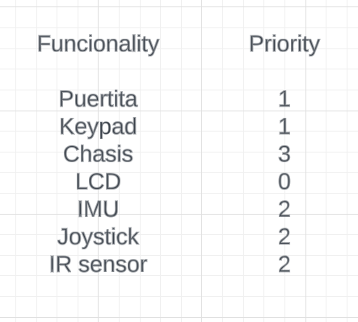
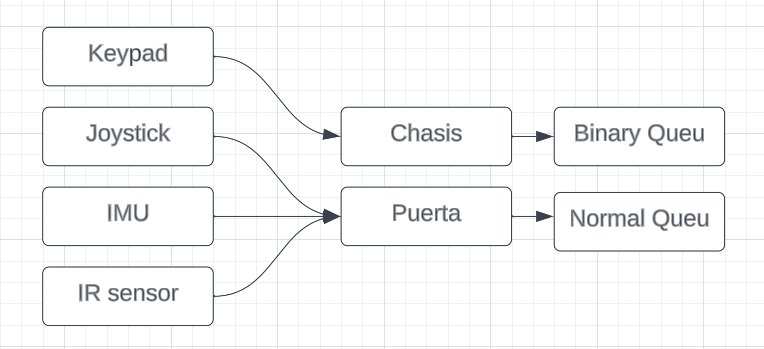

# KiwiBot
Repo for the kiwi chassis.
This repo constains the necesary code for core functions in the embedded system design. 

## Resources

### FreeRTOS
* [FreeRTOS functions doc](https://www.freertos.org/fr-content-src/uploads/2018/07/FreeRTOS_Reference_Manual_V10.0.0.pdf)
* [FreeRTOS concepts intro](https://www.freertos.org/implementation/main.html)
* [Mastering FreeRTOS _Book_](https://www.freertos.org/fr-content-src/uploads/2018/07/161204_Mastering_the_FreeRTOS_Real_Time_Kernel-A_Hands-On_Tutorial_Guide.pdf)
* Hands-On RTOS with microcontrollers. _Brian Amos_

### CubeIDE
* [Configure VS Code and CubeIDE environment](https://embeddedgeek.net/)
* [Strat RTOS project](/doc/pdfs/Steps4FRTOS_CubeIDE.pdf)

### Control resources:
* Introduction to Mobile Robot Control. _Spyros G Tzafestas_
* [First Kiwi Paper](/doc/pdfs/pin1994.pdf)
-----------------------------------------------
## TODO:
### Tasks:
- [ ] Movement interpreter 
  - [ ] Joystick reading
  - [ ] Simple kinematics system
- [ ] I2C comm 9 axis IMU
- [ ] Ultrasonic sensor digital
- [ ] Inverse kinematics system
- [ ] IMU Signal Processing
- [ ] Password check

### Classes:
- [ ] Encoder
- [ ] Motor control
- [ ] Chassis movement
- [ ] Ultrasonic sensor
- [ ] IMU Sensor
- [ ] Servo

### Design:
- [ ] Revisar condicion camb en diagrama de estados
- [ ] Pasar de los diagramas de inspiración a los reales
- [ ] En el class diagram del motor, cambiar el método para tener un channel variable  //__HAL_TIM_SET_COMPARE(htimPWM, TIM_CHANNEL_1, control);

## Block diagram:

## Control diagram:

## Movement Flow diagram:

## State diagram:

## Task priority:

## Task relation:

